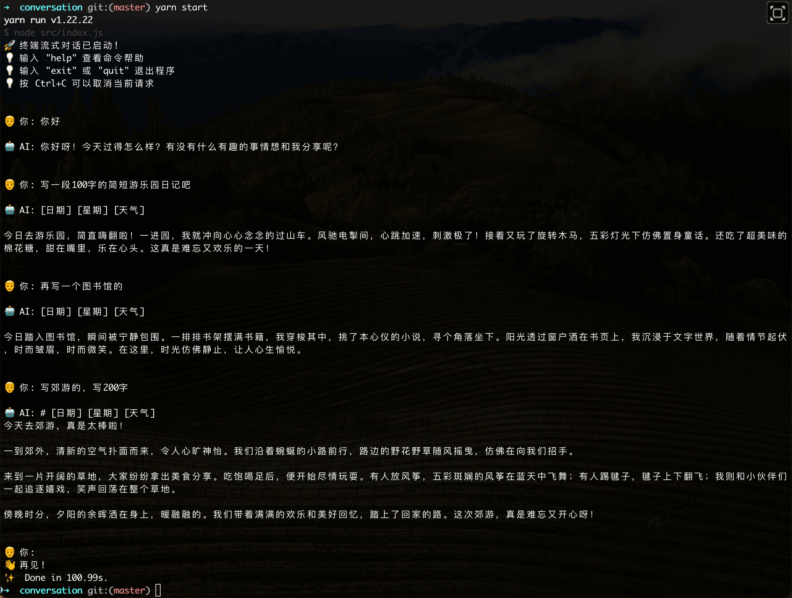

# 终端流式对话应用

基于Node.js实现的终端流式对话应用，支持与大模型进行实时对话。

## 功能特性

- 🚀 流式响应，实时显示AI回复
- 💬 支持多轮对话，保持上下文
- ⏹️ 支持中断请求（Ctrl+C）
- 🧹 支持清空对话历史
- 📝 友好的终端界面

## 演示



## 安装和使用

1. 进入conversation目录：
```bash
cd conversation
```

2. 设置API密钥（二选一）：
```bash
# 方法1: 设置环境变量
export API_KEY="your_api_key"

# 方法2: 在.env中直接配置
```

3. 启动应用：
```bash
npm start
# 或
node index.js
```

## 命令说明

- `exit` 或 `quit`: 退出程序
- `clear`: 清空对话历史
- `help`: 显示帮助信息
- `Ctrl+C`: 取消当前请求或退出程序

## 配置选项

在 `index.js` 中可以修改以下配置：

```javascript
const { extractContentFromSiliconFlowChunk } = require('./transformers');

const siliconflow_config = {
  apiKey: process.env.API_KEY,
  apiUrl: 'https://api.siliconflow.cn/v1/chat/completions',
  model: "Qwen/Qwen2.5-7B-Instruct",
  chunkTransform: (chunk) => {
    const chunkStr = extractContentFromSiliconFlowChunk(chunk);
    return chunkStr;
  }
};
```

## 核心模块说明

### streamQuery.js
- Node.js版本的流式查询实现
- 使用原生http/https模块替代fetch
- 支持请求中断和错误处理

### chat.js
- 终端对话界面实现
- 使用readline模块处理用户输入
- 支持SSE格式数据解析
- 实现对话历史管理

### index.js
- 应用入口文件
- 配置管理